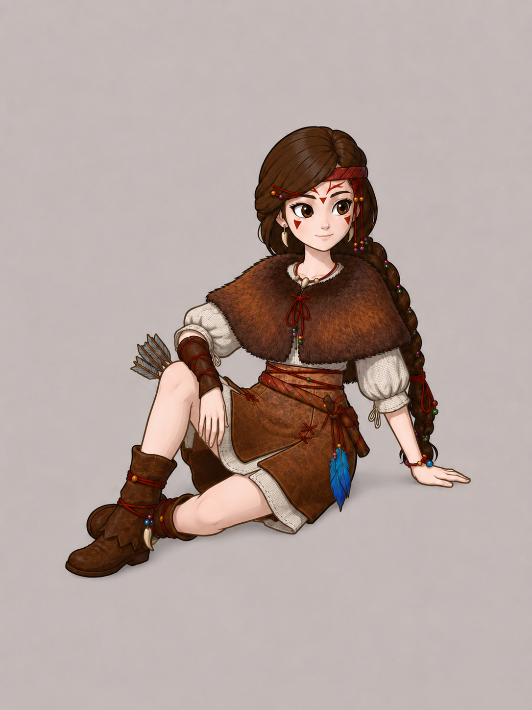

# 小纳雅桌宠 · 重置版

这是一款面向 macOS 的桌面宠物。她首先是一只能够独立运行的桌宠：不配置 AI 也可以陪伴、待机和互动；用户主动接入自己的 AI 接口后，才会解锁对话、长期记忆和可选的电脑操作能力。

这次不是在旧像素版上继续修补，而是从角色母版、动画结构、界面语言和 AI 架构重新制作。

> 当前状态：`Pre-Alpha / 重置版设计与技术验证阶段`。仓库暂时没有对外安装包；只有达到“新角色已进入程序、眨眼不带动身体、基础面板完成、macOS 实机通过”后，才会发布第一个可安装版本。

> 制作约束已经确认：不购买 Live2D、Spine 等付费工具，也不依赖专业绑定师。Godot 继续负责桌宠程序；角色绑定优先验证可由 Codex 直接控制的开源工具，并保留 Blender/Godot 原生路线作为回退。正式工具链只会在小样通过后锁定。

<p align="center">
  
</p>

<p align="center"><sub>重置版角色与慵懒坐姿方向稿；这是造型参考，不是最终运行截图。</sub></p>

## 为什么要重置

旧版使用多张完整人物 PNG 切换眨眼和表情。不同图片不只眼睛变化，身体、衣服和轮廓也会被模型重新绘制，因此每次闭眼、睁眼都可能出现全身抽动。继续把“看起来好的部分”抠下来拼贴，只会累积比例、光影和线条不一致的问题。

重置版采用以下原则：

- 先确认一张统一的新版角色母版，再制作可复用图层，不从旧图东拼西凑
- 身体保持稳定；眨眼只驱动眼皮，视线只驱动瞳孔，微表情只改变对应部位
- 所有图层使用固定锚点、固定画布和固定比例，防止切换时跳位
- 较大的转身和姿势变化使用独立、经过校准的姿态，而不是把正面图强行旋转或镜像
- 角色、动画、UI、AI、记忆和电脑控制分别设计，避免继续堆进一个巨大脚本
- 只使用免费或开源制作工具；先用最小样机验证绑定、保存重开、透明导出和 Godot 接入，再开始正式角色生产

## 已确认的产品方向

- 默认是慵懒坐姿，保持清醒并随时可以互动
- 眼睛可以自然眨动、偶尔观察鼠标，并配合轻微转头、呼吸和发辫弹性
- 大型待机动作约每 10～20 分钟出现一次，夜晚有更困倦但不进入强制睡眠的动作
- 猴头菇精灵不是常驻角色，会偶尔飞来、停在肩上或落到手中互动
- AI 是可选能力；桌宠基础体验不能依赖 API
- 支持 OpenAI、DeepSeek、Claude、Gemini 和常见 OpenAI 兼容中转站，并尽量自动识别协议与模型
- 聊天气泡跟随角色位置自动避让；完整聊天记录在管理面板查看
- 会话压缩、长期记忆、记忆编辑和回收站全部保存在本地
- API Key 使用 macOS 钥匙串保存，不写入普通配置文件
- 电脑控制能力默认不安装、默认关闭；用户主动配置 AI 并选择权限后才按需下载
- 电脑控制权限分为只读、修改前询问、完全允许三档，默认只读
- 第一阶段完整支持 macOS；架构为后续 Windows 版本预留系统适配层

## 首个安装包的验收门槛

第一个 GitHub Release 至少需要同时满足：

1. 使用已确认的重置版角色造型，而不是旧像素素材。
2. 待机、眨眼和视线跟随采用稳定分层结构，身体不抽动。
3. 至少有一套慵懒默认姿势、一套自然待机循环和一套夜间困倦动作。
4. 基础设置面板与聊天气泡使用统一的新视觉语言。
5. 不接 AI 时桌宠也能完整运行。
6. macOS Apple 芯片实机启动、拖动、退出和重开验证通过。
7. 安装包经过签名状态检查；未公证版本必须明确提示安装方式和风险。

## 仓库结构

目前仓库先保存重置版需求、视觉方向和后续实现。旧版 Godot 工程留在本机作为问题对照，不会混进重置版主仓库。

```text
docs/
  concepts/               已确认的视觉方向稿
  confirmed-requirements.md
  architecture-principles.md
  environment-prerequisites.md
  implementation-plan-draft.md
  research/               桌宠前例与技术路线调研
```

等动画技术路线和基础界面定稿后，再加入新的 Godot 工程、自动化测试与构建脚本。

## 研究与计划

- [桌宠前例与技术路线调研](docs/research/desktop-pet-precedents-2026-07.md)
- [免费角色绑定工具链调研](docs/research/rigging-toolchain-options-2026-07.md)
- [电脑控制能力包候选](docs/research/computer-control-runtime.md)
- [开发与发布前提条件](docs/environment-prerequisites.md)
- [重置版实施计划（讨论稿）](docs/implementation-plan-draft.md)
- [已经确认的需求](docs/confirmed-requirements.md)
- [重置版架构原则](docs/architecture-principles.md)
- [决策 0001：免费开放角色生产管线](docs/decisions/0001-free-open-rig-pipeline.md)

## 项目说明

这是正在开发的非官方同人项目，与原作制作方、发行方及相关权利人不存在官方合作或授权关系。角色与原作相关权利归其各自权利人所有，详见 [NOTICE.md](NOTICE.md)。
